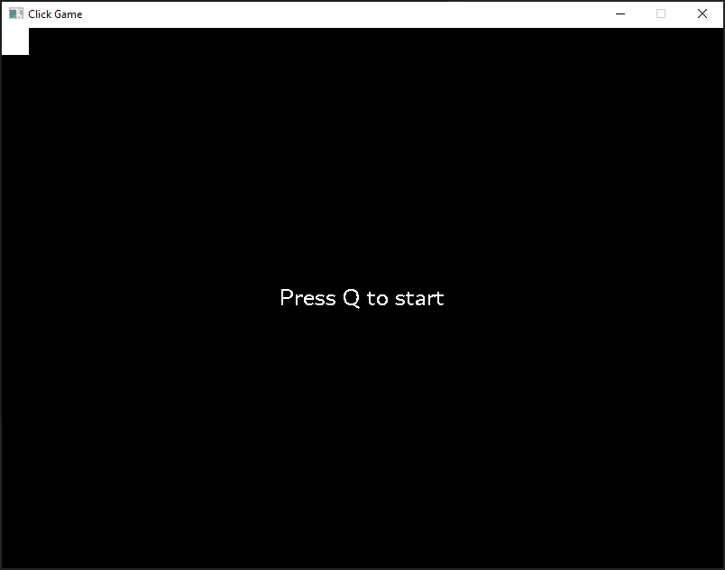
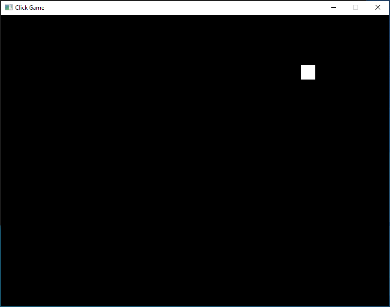
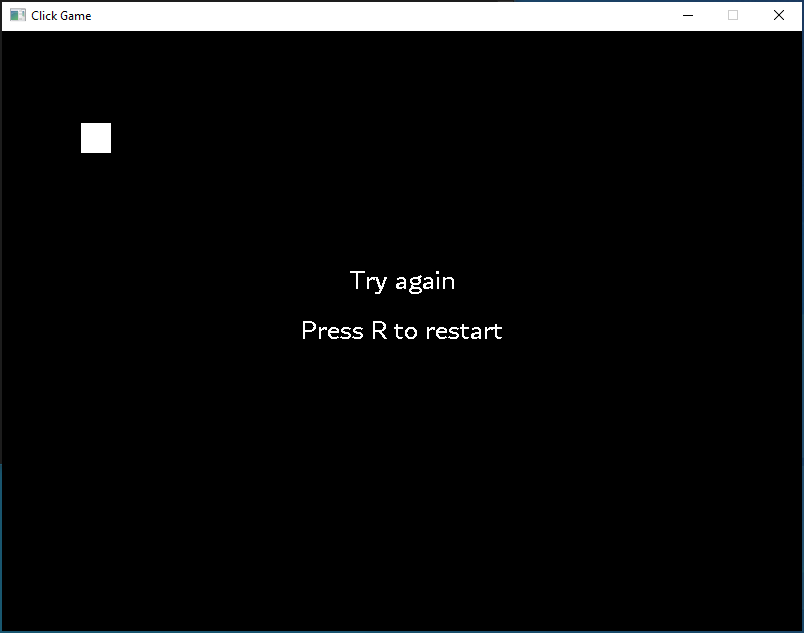
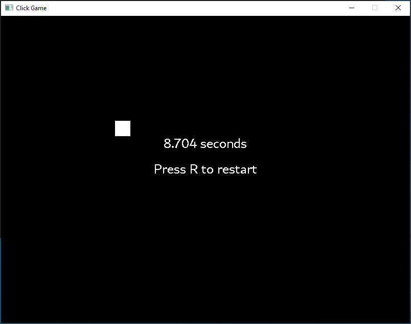
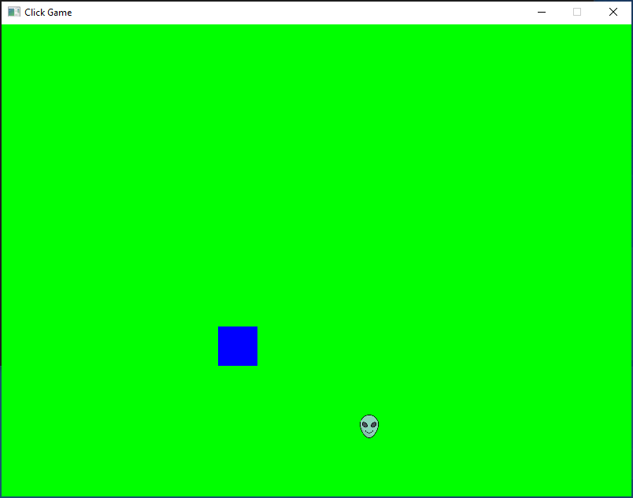

## Mouse Accuracy Training

#### White square appears ten times at random location, click it as soon as possible.
#### If you click background instead of the square or collide with the alien, then the game will be over.

##### Key
* Q: Game start
* R: Game re-start
* Escape: Quit
* 1: background color change manually
* 2: square, letter color change manually

##### Change game mode (can’t change while it is playing)
* Z: Color change
* X: Square moving
* C: Alien appears
* TAB: infinite mode

##### Change properties of objects (can’t change while it is playing)

  
||Square|Alien
---|---|---|
Size up | D | Right
Size down | A | Left
Speed up | W | Up
Speed down | S | Down

